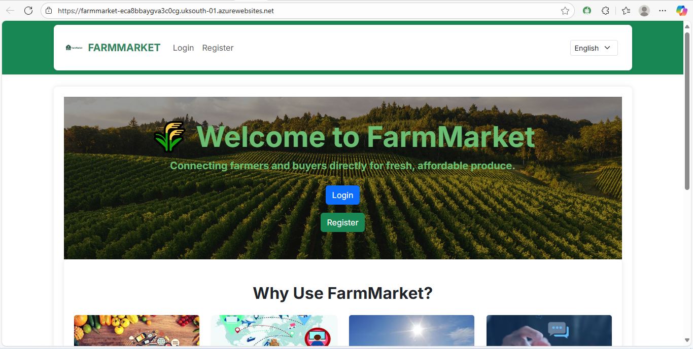
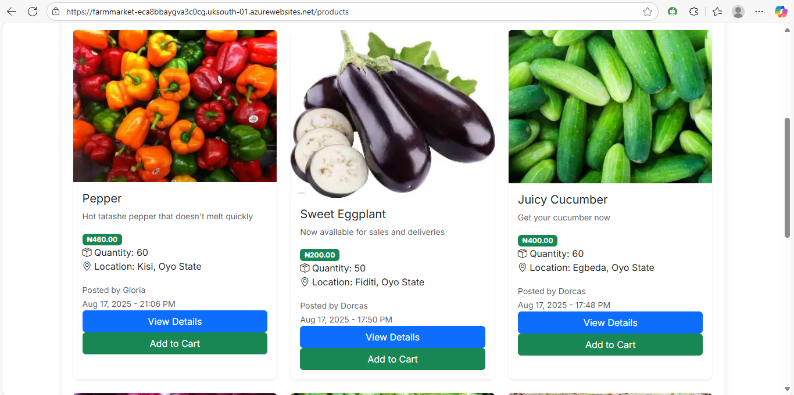
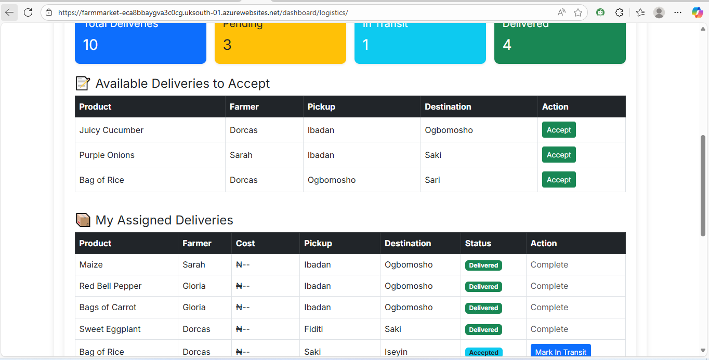
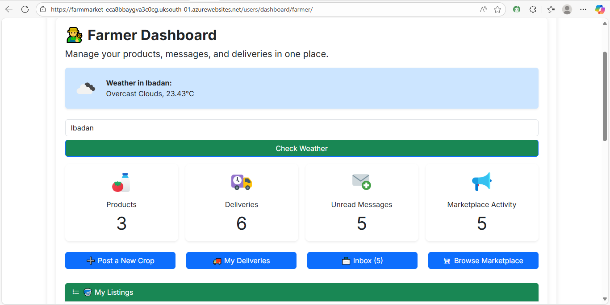
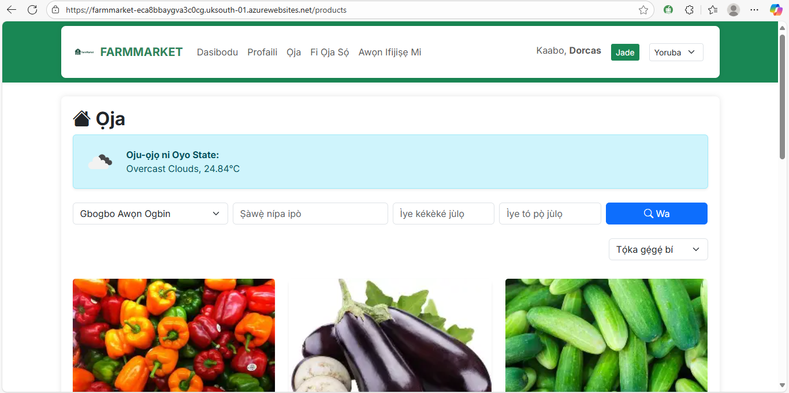

# 🌾 FarmMarket – Connecting Farmers and buyers directly

**Live:** https://farmmarket-duaqhkb6aefvbcf5.ukwest-01.azurewebsites.net/

**GitHub Repo:** https://github.com/blessing267/repo.git  

---

## 📖 About the Project  
FarmMarket is a full-stack Django marketplace designed to connect farmers, buyers and logistics agents within a single platform.

The application enables farmers to advertise agricultural products, buyers to discover and contact sellers, and logistics agents to manage delivery requests. It also integrates location-based weather information to support users with relevant agricultural conditions.

The project was developed to explore how web and cloud technologies can improve access to agricultural markets while bringing product discovery, communication and delivery coordination into one system.    

---

## 🛠️ Technologies Used  
- **Backend:** Python, Django
- **Frontend:** HTML, CSS, Bootstrap 5
- **Database:** SQLite
- **Cloud:** Microsoft Azure
- **Deployment:** Azure App Service
- **Internationalisation (i18n):** Django i18n, English & Yoruba
- **External APIs:** OpenWeather API
- **Version Control:** Git & GitHub
- **Other:** Django Crispy Forms, Bootstrap Icons

---

## 📸 Screenshots  
**Homepage:**

**Product page:**

**Logistics page:**

**Weather forecast:**

**Language translate:**
 

---

## 🚀 Features  
- 🌾 **Agricultural Marketplace** – Farmers can list agricultural products with images, descriptions, prices, quantities and locations.
- 🔎 **Product Search & Filtering** – Buyers can search, filter and sort available products to find relevant listings.
- 👨🏽‍🌾 **Farmer Product Management** – Farmers can create, edit and delete their own product listings.
- 👥 **Role-Based Functionality** – Supports different functionality for farmers, buyers and logistics agents.
- 💬 **Messaging System** – Users can communicate through an integrated messaging system with inbox and sent-message functionality.
- 🚚 **Delivery Management** – Users can create delivery requests while logistics agents can manage and update delivery statuses.
- 📦 **Delivery Tracking** – Delivery requests can progress through statuses including pending, accepted, in transit, delivered and cancelled.
- 🌤️ **Weather Information** – Provides weather lookup functionality to give users access to relevant local weather conditions.
- 📍 **Location-Based Listings** – Agricultural products include city and state information to help buyers identify where products are available.
- 🌐 **Multilingual Support** – Includes internationalisation support for English and Yoruba.
- 📱 **Responsive Interface** – Designed using Bootstrap for accessibility across desktop and mobile devices.      

---

## 👥 User Roles

### Farmer

Farmers can:
- Create agricultural product listings.
- Add product images, descriptions, prices, quantities and locations.
- Edit and delete their own listings.
- Communicate with other users.
- Manage requests relating to their products.
- Track delivery progress

### Buyer

Buyers can:
- Browse agricultural products.
- Search, filter and sort listings.
- View detailed product information.
- Communicate with other users.
- Create delivery requests.
- Track delivery progress

### Logistics Agent

Logistics agents can:
- View delivery requests.
- Manage assigned deliveries.
- Update delivery statuses.
- Track delivery progress

---

## 🔗 Related Projects  
- Lily Beauty Bar: https://github.com/blessing267/lilybeautybar.git  
- AHU Web App: https://github.com/blessing267/django-app.git
- Dessert Affairs: https://github.com/blessing267/dessert-affairs.git
