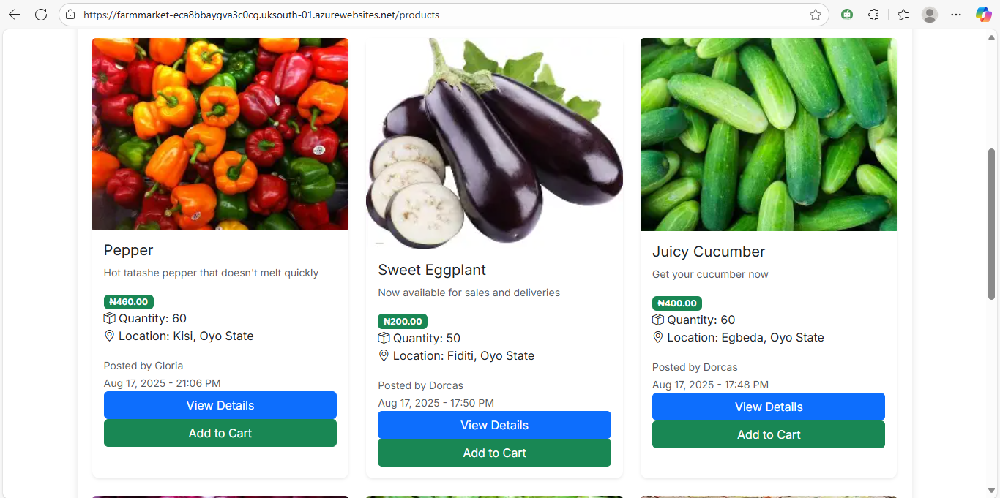

# 🌾 FarmMarket – Connecting Farmers to Markets  

**Link:** [(https://farmmarket-eca8bbaygva3c0cg.uksouth-01.azurewebsites.net)] 
**Live Demo:** [https://lilybeautybar.onrender.com](https://lilybeautybar.onrender.com) 

**GitHub Repo:** ([https://github.com/blessing267/repo.git])  

## 📖 About the Project  
FarmMarket is a digital platform developed as my MSc dissertation at Sheffield Hallam University.  
It connects farmers with buyers to improve market access.    

## 🚀 Features  
- Farmer & buyer registration
- Language translator 
- Product listing by farmers  
- Direct messaging & notifications  
- Weather information widget  

## 🛠️ Technologies Used  
- Django (Python)  
- Azure App Service  
- MySQL Flexible Server  
- Bootstrap   

## 👩🏽‍💻 My Role  
I designed and implemented the backend architecture, integrated Azure services, and led deployment.  

## 📚 Learnings  
This project helped me strengthen my skills in Django, external API, integrating multilingual support and a light deployment for a prototype. 

## 📸 Screenshots  
**Homepage:**

**Product page:**

**Logistics page:**

**Weather forecast:**

**Language translate:**
 
